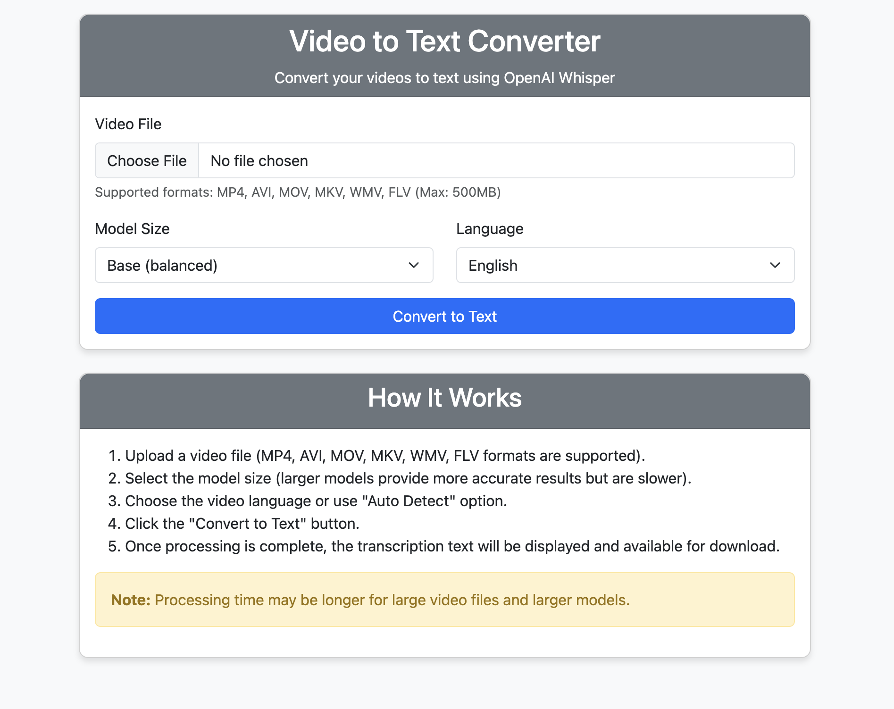
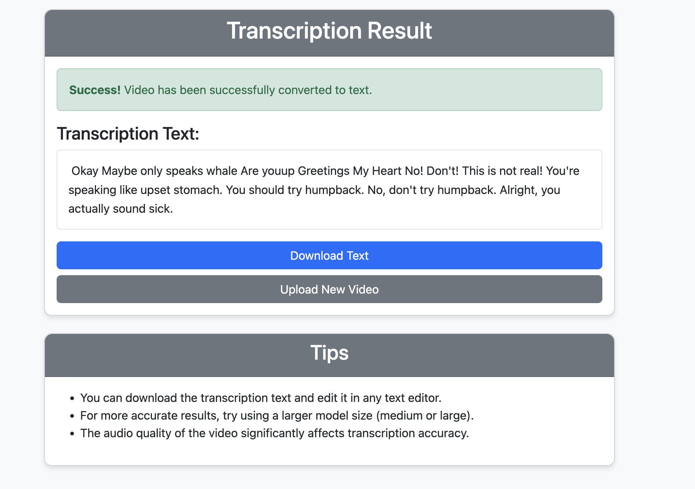

# Video to Text Converter using Whisper

This project allows you to convert video files to text using OpenAI's Whisper model.



## Features

- Convert video files to text using OpenAI's Whisper model
- Support for multiple languages with automatic language detection
- Web interface and command-line options
- Multiple model sizes (tiny, base, small, medium, large) for different accuracy/speed tradeoffs
- Download transcription results as text files

## Installation

1. Install the required libraries:
```
pip install -r requirements.txt
```

2. Install FFmpeg:
   - macOS: `brew install ffmpeg`
   - Ubuntu: `sudo apt update && sudo apt install ffmpeg`
   - Windows: [FFmpeg Download Page](https://ffmpeg.org/download.html)

## Command-Line Usage

Basic usage:
```
python video_to_text.py --video_path "video_file.mp4"
```

All options:
```
python video_to_text.py --video_path "video_file.mp4" --model_size "base" --output_file "output.txt" --language "en"
```

### Parameters

- `--video_path`: Path to the video file to be converted to text (required)
- `--model_size`: Whisper model size to use (tiny, base, small, medium, large) (default: base)
- `--output_file`: Name of the output text file (default: output.txt)
- `--language`: Specify the video language (ISO code, e.g. en, tr, fr, or 'auto' for automatic detection) (default: en)

## Web Interface

To use the web interface:
```
python app.py
```

You can use the application by going to `http://127.0.0.1:5000` in your browser.



### Web Interface Features

1. Upload video files (MP4, AVI, MOV, MKV, WMV, FLV formats supported)
2. Select model size based on your accuracy/speed requirements
3. Choose language or use automatic language detection
4. View and download transcription results

## Model Size Comparison

| Model Size | Accuracy | Speed | Memory Usage |
|------------|----------|-------|--------------|
| Tiny       | Lowest   | Fastest | ~1GB |
| Base       | Low      | Fast    | ~1GB |
| Small      | Medium   | Medium  | ~2GB |
| Medium     | High     | Slow    | ~5GB |
| Large      | Highest  | Slowest | ~10GB |

## License

This project is licensed under the MIT License - see the LICENSE file for details.

## Acknowledgments

- [OpenAI Whisper](https://github.com/openai/whisper) for the speech recognition model
- [MoviePy](https://zulko.github.io/moviepy/) for video processing
